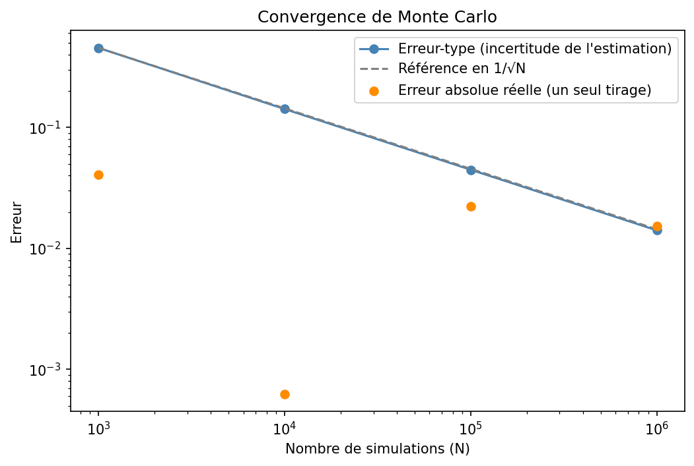

# Pricer d'options — Black-Scholes, Monte Carlo, arbre binomial et Greeks

Implémentation « from scratch » de trois méthodes de pricing d'options vanille (formule fermée, simulation Monte Carlo, arbre binomial CRR), avec calcul des Greeks par formule analytique et par différences finies, et étude de la convergence de chaque méthode.

## Le projet

Une option européenne a une formule fermée (Black-Scholes), mais cette formule ne couvre ni les options américaines ni les produits structurés à barrières. Ce projet implémente trois méthodes de pricing, vérifie qu'elles convergent vers le même prix sur une option européenne (ce qui valide chaque implémentation), puis utilise l'arbre pour ce que les autres savent mal faire : l'exercice anticipé.

L'option de référence est un call/put à la monnaie : spot = strike = 100, maturité 1 an, taux sans risque 3 %, volatilité 20 %, sans dividende.

## Résultats clés

| | Call européen | Put européen | Put américain |
|---|---|---|---|
| Black-Scholes | 9,4134 | 6,4580 | — |
| Monte Carlo (1 million de simulations) | 9,3980 ± 0,0141 | 6,4740 ± 0,0094 | — |
| Arbre binomial (2 000 pas) | 9,4124 | 6,4570 | 6,7425 |

| Greek (call de référence) | Analytique | Différences finies |
|---|---|---|
| Delta | 0,5987 | 0,5986 |
| Gamma | 0,0193 | 0,0193 |
| Vega (par point de volatilité) | 0,3867 | 0,3868 |
| Theta (par jour) | -0,0147 | -0,0147 |
| Rho (par point de taux) | 0,5046 | 0,5117 |

**Les trois méthodes convergent vers le même prix.** L'écart de Monte Carlo reste de l'ordre d'une erreur-type, et l'arbre est toujours légèrement en dessous de Black-Scholes, d'un écart divisé par 4 quand on passe de 500 à 2 000 pas. La parité call-put est respectée (9,4134 − 6,4580 = 2,9554 = S − K·e^(−rT)).

**Les deux erreurs ne se comportent pas pareil.** L'erreur-type de Monte Carlo suit une loi en 1/√N (pente de -0,503 en échelle log-log, théorie : -0,5) mais l'erreur d'un tirage donné est aléatoire : un prix Monte Carlo se donne donc toujours avec son erreur-type. L'erreur de l'arbre est déterministe et suit 1/n (pente de -0,998) : doubler le nombre de pas divise l'erreur par 2.

**Le put américain vaut plus que le put européen** : 6,7411 contre 6,4540 à 500 pas, soit une prime d'exercice anticipé de 0,2871, qui atteint 2,91 pour un spot de 60 (option très dans la monnaie). Le call américain vaut le même prix que l'européen en l'absence de dividende (9,4094), car il n'est jamais optimal de l'exercer avant l'échéance.

**Les Greeks analytiques et par différences finies concordent**, à l'exception du rho (0,5046 contre 0,5117) : la différence finie utilise un saut complet de +1 point de taux, et le prix est courbe en fonction du taux. Le gamma, le vega et le theta sont maximaux (en valeur absolue) près de la monnaie mais pas exactement au strike : gamma vers un spot de 91,5, vega vers 99 et theta vers 105.

## Fichiers

| Fichier | Description |
|---|---|
| `Pricer_Options_BS_MC_Binomial.ipynb` | Notebook Python complet : Black-Scholes, Monte Carlo, arbre binomial, Greeks, exercice anticipé, comparaison, conclusion |
| `convergence_mc.png`, `convergence_arbre.png`, `greeks_spot.png`, `prime_exercice.png` | Graphiques générés par le notebook |
| `convergence_monte_carlo.csv`, `convergence_arbre.csv`, `comparaison_methodes.csv`, `greeks_atm.csv`, `greeks_selon_spot.csv`, `prime_exercice_put.csv` | Résultats numériques exportés par la dernière cellule du notebook |
| `Pricer_Options_Dossier.pdf` / `.docx` | Dossier méthodologique : méthodes, résultats, limites |

## Outils

Python (numpy, pandas, scipy, matplotlib), notebook Google Colab.

## Limites et pistes d'amélioration

- Volatilité constante : Black-Scholes ignore le smile de volatilité observé sur le marché. Un modèle à volatilité locale ou stochastique (Dupire, Heston) serait la suite logique.
- Une seule option de référence (à la monnaie, 1 an) et pas de dividende : le call américain n'a donc pas de prime d'exercice, alors qu'il en aurait une avec dividende.
- Aucune donnée de marché : les paramètres sont fixés à la main, sans calibration sur des cotations réelles d'options.
- Monte Carlo simple, sans réduction de variance (variables antithétiques, variables de contrôle).
- Arbre CRR uniquement : la paramétrisation de Leisen-Reimer ou de Tian converge plus vite que 1/n.

---
*Projet réalisé dans le cadre d'une recherche de stage/alternance en finance de marché (front office, produits structurés).*
